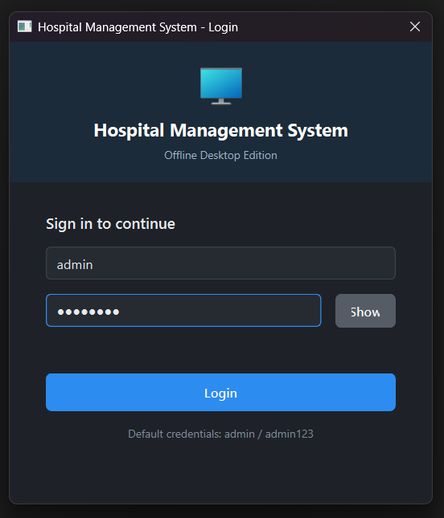
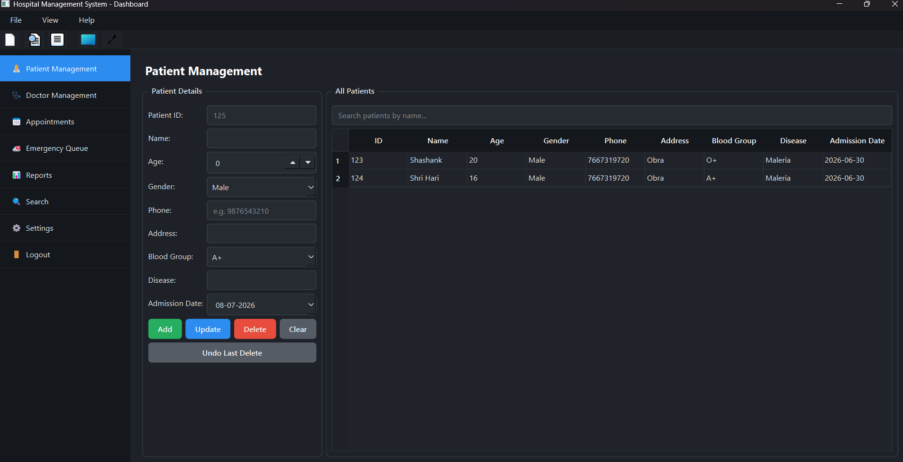
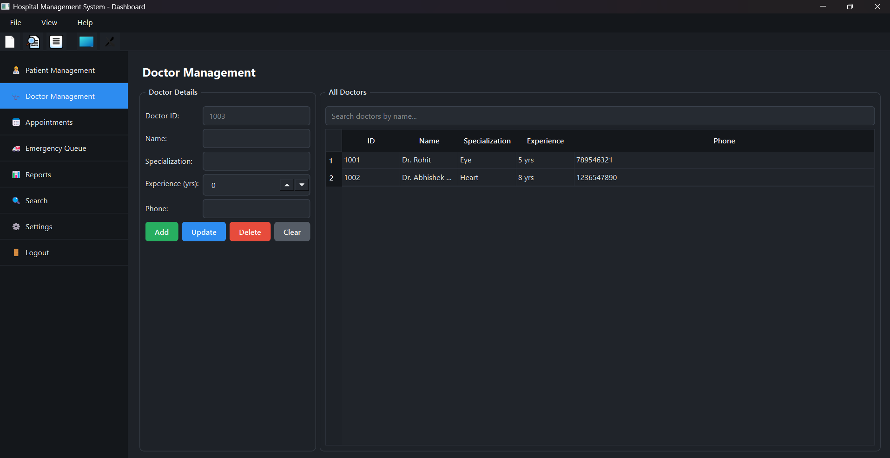
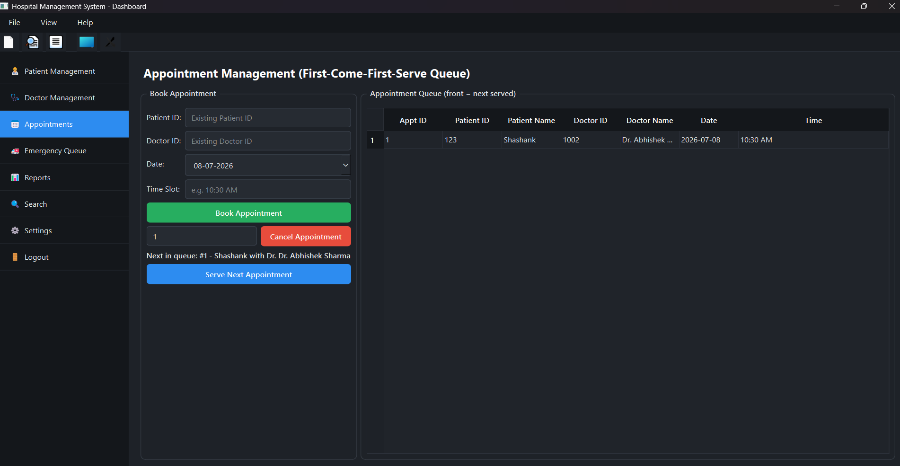
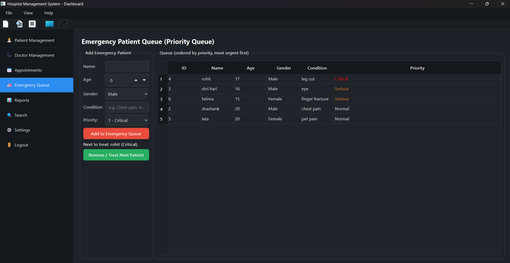
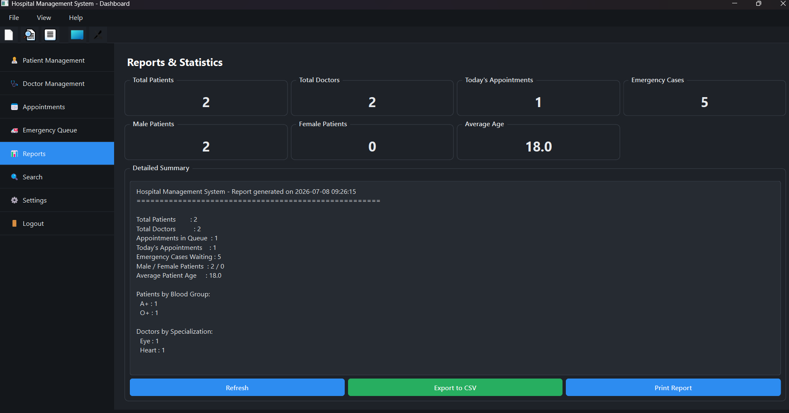

# 🏥 Hospital Management System

A GUI-based **Offline Hospital Management System** developed using **C++17** and **Qt Widgets** as a semester project for the **Data Structures** course.

## 📌 Project Overview

The Hospital Management System is a standalone desktop application that helps manage hospital operations such as patient records, doctor information, appointments, and emergency cases. The system stores data locally using text files and demonstrates the practical implementation of various data structures.

## ✨ Features

- 🔐 User Login Authentication
- 👨‍⚕️ Patient Management
  - Add Patient
  - Edit Patient
  - Delete Patient
  - Search Patient
- 🩺 Doctor Management
- 📅 Appointment Booking
- 🚑 Emergency Patient Priority Queue
- 📊 Reports and Statistics
- 💾 Offline File Storage
- 🌙 Light/Dark Theme

---

## 📚 Data Structures Used

| Data Structure | Purpose |
|----------------|---------|
| Linked List | Store patient records |
| Queue | Appointment scheduling |
| Priority Queue | Emergency patient management |
| Stack | Undo operations |
| unordered_map | Fast searching |
| Vector | Data storage |

---

## 🛠 Technologies Used

- C++17
- Qt Widgets
- Qt Creator
- Object-Oriented Programming (OOP)
- STL
- File Handling

---

## 📂 Project Structure

```
HospitalManagementSystem/
│
├── main.cpp
├── mainwindow.cpp
├── mainwindow.h
├── login.cpp
├── login.h
├── patient.cpp
├── patient.h
├── doctor.cpp
├── doctor.h
├── appointment.cpp
├── appointment.h
├── emergency.cpp
├── emergency.h
├── filemanager.cpp
├── filemanager.h
├── HospitalManagementSystem.pro
├── resources.qrc
├── styles.qss
├── README.md
```

---

## 🚀 How to Run

1. Install Qt Creator and Qt 6.x.
2. Clone this repository.
3. Open `HospitalManagementSystem.pro` in Qt Creator.
4. Configure the Qt Kit.
5. Build the project.
6. Run the application.

---

## 📷 Screenshots

### Login Screen



### Patient Management



### Doctor Management



### Appointment Module



### Emergency Queue



### Reports Module



---

## 🎯 Learning Outcomes

- Practical implementation of Data Structures.
- GUI development using Qt Widgets.
- Object-Oriented Programming in C++.
- File Handling.
- Event-driven programming.

---

## 📈 Future Enhancements

- SQLite/MySQL database support.
- Online appointment booking.
- Email and SMS notifications.
- Medical report management.
- Billing and payment system.
- Multi-user login.

---

## 👨‍💻 Author

**Shashank Kumar**

Semester Project – Data Structures

---

## 📄 License

This project is developed for educational purposes only.
